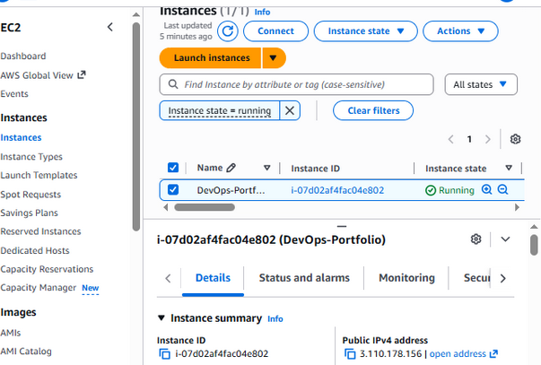

# Ashok's DevOps & Cloud Portfolio

## 🚀 Projects Overview

### AWS & Networking
- Designed highly available architecture using AWS EC2
- Configured VPC, subnets, route tables, and security groups
- Implemented Load Balancer and Auto Scaling

### Docker + CI/CD
- Containerized application using Docker
- Created CI/CD pipeline using GitHub Actions
- Automated deployment to EC2

### Automation (Optional)
- Bash scripting for automation
- Cron jobs for scheduling tasks
- Logging system implemented

## 🛠 Tech Stack
- AWS (EC2, VPC, Load Balancer, Auto Scaling)
- Docker
- GitHub Actions (CI/CD)
- Linux & Bash

## 📸 Screenshots

### AWS Setup

### Docker & CI/CD

